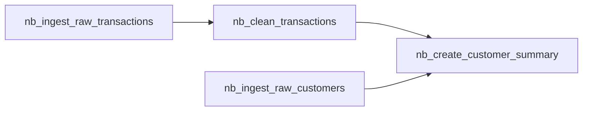

# Transactions Analysis

This example demonstrates how Jorvik can help you build reliable/ production hardened data pipelines. It follows the [Medallion Data Architecture](https://www.databricks.com/glossary/medallion-architecture) and utilizes both notebooks and python files to create reusable and testable software components. It is a multi stage pipeline and is composed by 4 notebooks/ stages in order to create a customer summary table where the total and average spent of every customer are calculated. The pipeline's DAG is shown bellow:



In the heart of the example is the `etl` decorator. A lot of repeated work has been abstracted out and the developer needs to only specify the schemas for input and output data and the transformations that need to be applied to them. Behind the scenes it will verify that the input and output have the expected schema and it will fail the pipeline if they do not. This behavior can be turned off by supplying the `validate_schemas=False` parameter. It is though recommended to keep it on, as silent schema changes can negatively affect your data quality.

The example also follows a few more guidelines to help navigating the source code and link datasets with the notebooks producing them.
- All notebooks start with the `nb_` prefix
- Notebook name contains the produced table name
- Code also follows the Medallion Architecture, placing every producer notebook in the same path as the produced dataset.
- Dataset schemas are placed on python files in the schemas package so they can be reused.

To run the pipeline in Databricks you can clone the repository in your Databricks workspace. In the "Jobs & Pipelines" page create a job, on the top right corner click the three dots and select edit as yaml, paste the contents of pipeline.yaml file and you are ready to go. The only prerequisite is to mount a cloud storage on the paths `/mount/bronze` and `/mount/silver`.

To run the tests clone the repository and simply run the following commands in the repository's root folder:
```bash
pip install -r requirements.txt
pip install pytest
pytest examples/databricks/transactions/tests
```
