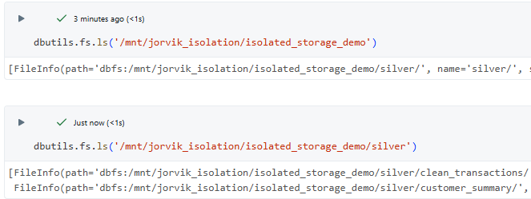
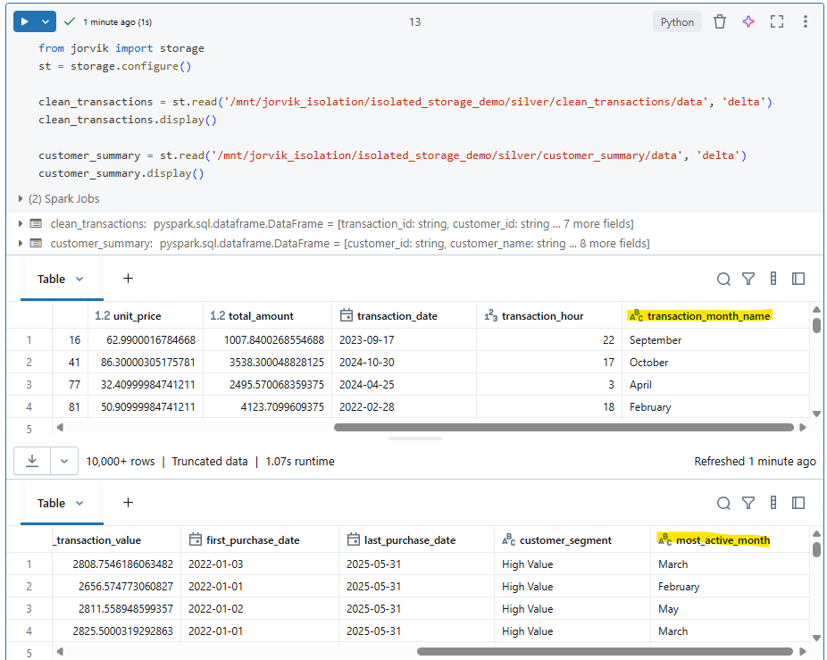

This section demonstrates how Jorvik Isolation Storage is applied to handle development environments in in [Transaction Analysis Example](README.md)

# Scenario
Imagine the 4-step dataflow described in the [Transaction Analysis Example](README.md)  is running as a production job.  
Business stakeholders now require an additional metric in the Customer Summary Report: identifying the month in which each customer is most active (i.e., the month with the highest number of transactions) to better understand seasonal behavior.

To fulfill this requirement, updates will be made to the transformation logic in two silver steps:

- **`/silver/nb_clean_transactions`** – extract the month name from the transaction timestamp  
- **`/silver/nb_create_customer_summary`** – add a new field indicating the most active month for each customer  

These changes also impact the resulting tables of each step:  

- **`/silver/clean_transactions`** – a new field `transaction_month_name` will be created  
- **`/silver/customer_summary`** – a new field `most_active_month` will be created  

You have made the [necessary changes](https://github.com/jorvik-io/jorvik/compare/isolated_storage_demo) in the feature branch [`isolated_storage_demo`](https://github.com/jorvik-io/jorvik/tree/isolated_storage_demo) and now want to test the pipeline in a Development environment. The goal is to verify the results under the following conditions:

- No need to copy the entire raw data from the bronze layer into the development environment  
- Test pipeline runs without impacting production data or other parallel development work  
- Once the results meet the requirement, code changes can be safely deployed to production without the need to rewire test paths back to production paths  

This scenario is similar to the [Storage Isolation example](../../../jorvik/storage/README.md#scenario) presented in Jorvik Isolation module

# Demonstration
## Set up Databricks Jobs

1. **Create the Production Job**  
   - In Databricks, create a new Job. From the dropdown menu, select **Edit as YAML** and paste the content from [production_job.yaml](jobs/production_job.yaml).  
   - This creates the production job named **Transactions Example** with 4 steps.  
   - In the job configuration, note the following:  
     - `git_source.git_branch` is set to `main`, since this is the production job.  
     - `job_clusters.job_cluster_key...spark_conf.io.jorvik.storage.isolation_provider` is set to `DATABRICKS_GIT_BRANCH`. This instructs Jorvik to use the current Git branch in Databricks as the isolation provider. However, because the branch is `main`, isolation storage is ignored.  

2. **Create the Development Job**  
   - Create another Job to represent the development pipeline, this time pasting the content from [dev_job.yaml](jobs/dev_job.yaml).  
   - In the job configuration, note the following:  
     - `git_source.git_branch` is set to feature branch `isolated_storage_demo`  
      - The new job, named **Transactions Example DEV**, contains only the 2 silver steps where changes occur.  
   - The purpose of this job is to rerun only the modified parts of the pipeline while keeping the unchanged upstream steps intact.  

## Run Jobs

3. Execute the production job **Transactions Example** to populate production data.  
4. Execute the development job **Transactions Example DEV** to validate your changes.  

## Validate Results

5. Check the production silver tables:  
   - `/mnt/silver/clean_transactions/data`  
   - `/mnt/silver/customer_summary/data`  

   ✅ These production tables remain unchanged — the new fields are **not** yet created.  

6. Inspect the DBFS path:  
   - `/mnt/jorvik_isolation`  

   Here you’ll find a subdirectory named **`isolated_storage_demo`** (matching the feature branch name).  
   This is the isolated storage space, which contains only the 2 modified silver tables and no bronze tables.  

     

7. Explore the two newly created tables inside the isolated storage. These tables now include the new fields introduced by the code changes: `transaction_month_name` and `most_active_month`
    