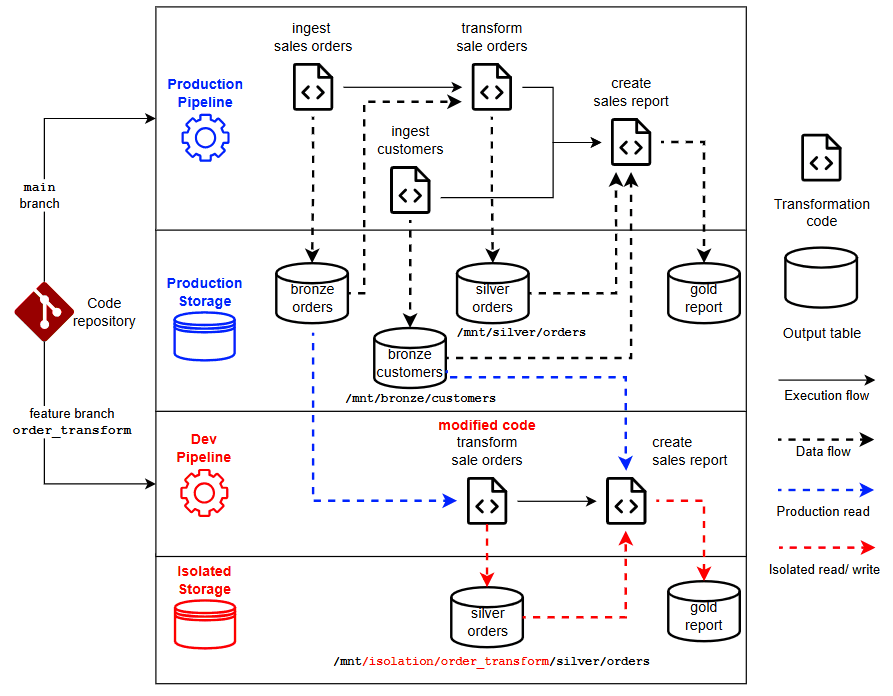

The Storage package provides utilities for reading and writing files in the storage layer.

# Basic
```python
from jorvik import storage
st = storage.configure()
df = st.read("/path/to/table/", format="delta")
st.write(df, "/new/path/to/table", format="parquet", mode="overwrite")
```

# Storage isolation

In a multi-step ETL pipeline, each step produces an intermediate table that serves as input for downstream transformations. When changes are made to upstream transformation logic, it's often necessary to re-run part or all of the pipeline in a development environment. This introduces two major challenges:
1. **Data synchronization:** All intermediate tables must be copied from production and kept in sync.
2. **Development conflicts:** Multiple ongoing developments in the same environment can interfere with each other’s intermediate data.

Jorvik's storage isolation feature addresses these challenges through the following key concepts:
- Each development effort runs in its own contained environment, called an **Isolation Context**, configured via an [Isolation Provider](#isolation-provider)
- When a table is **written** to storage, it is stored in a development-specific (isolated) path.
- When a table is **read** from storage:
    - If it exists in the isolated path, it is read from there.
    - Otherwise, it falls back to the production storage path.

This approach offers the following advantages:
- **No manual data copying:** Avoid the need to copy and sync intermediate tables from production.
- **Isolated development:** Prevent interference between parallel development efforts.
- **Seamless path handling:** Write once, run anywhere — the same code works in both development and production environments without path changes.
- **Save development storage:** Reuse production data wherever possible, reducing the need to duplicate large datasets in development environments.

## Example
The following example demonstrates how Jorvik's storage isolation feature works in practice.

### Pipeline setup
Assume a production ETL pipeline that follows the [Medallion Data Architecture](https://www.databricks.com/glossary/medallion-architecture), ingesting customer and sales data, transforming them, and ultimately producing a sales report.
The pipeline consists of four steps, each implemented in a separate code file. Each step reads from one or more tables and writes to a new table:
| Step | Description               | Input Source(s)         | Output Path                     |
|------|---------------------------|--------------------------|----------------------------------|
| 1    | Ingest customers          | Source system            | `/mnt/bronze/customers`         |
| 2    | Ingest sales orders       | Source system            | `/mnt/bronze/sales_orders`      |
| 3    | Transform sales orders    | Output of step 2         | `/mnt/silver/sales_orders`      |
| 4    | Create sales report       | Outputs of steps 1 & 3   | `/mnt/gold/sales_report`        |


### Scenario

Now, assume there's a change in the transformation logic in Step 3 — for example, introducing a new loyalty discount amount field in the sales orders. This modification impacts not only the refined sales data but also the final sales report.

To validate this change before deployment, Steps 3 and 4 need to be executed in a development environment. The code changes are made in a Git feature branch named `order_transform`.



### How Jorvik handles this with Storage Isolation
When Jorvik's storage isolation is applied, the following behavior occurs under the hood:

- Step 3: Transform Sales Orders
    - Input: Bronze sales order data is read directly from production storage since it remains unchanged.
    - Output: Transformed sales data is written to an isolated path: `/mnt/isolation/order_transform/silver/sales_orders`. This safeguards the silver table from being overwritten by concurrent development work.

- Step 4: Generate Sales Report
    - Input:
        - Customer data is read from the production path: `/mnt/bronze/customers`
        - Transformed sales data is read from the isolated path: `/mnt/isolation/order_transform/silver/sales_orders`
    - Output: The generated sales report is written to isolated path `/mnt/isolation/order_transform/gold/sales_report`

This setup allows the modified logic to be tested end-to-end without affecting production data or other development efforts.

## Isolated storage
```python
from jorvik import storage
st = storage.configure(isolation_provider.databricks.get_active_branch, verbose=True, track_lineage=True)
df = st.read("/mnt/path/to/table/", format="delta")
st.write(df, "/mnt/path/to/table", format="delta", mode="overwrite")
```

To configure Spark configuration keys for Isolated Storage update the below keys.

| Config keys                               | Default value | Required to be set |
| --------                                  | -------       |----------- |
| `io.jorvik.storage.isolation_folder`      | `str: = None`          | True |
| `io.jorvik.storage.mount_point`           | `str: = mnt`         | False |           
| `io.jorvik.storage.production_context`    | `'main,master,production,prod'` | False |

Configure the Isolated Storage by setting Spark configuration key `io.jorvik.storage.isolation_folder` to the name of a folder where isolated data should be written to. 

Example: 
* `spark.conf.set("io.jorvik.storage.isolation_folder", "isolated")`

If your mount point is not named `mnt`. Set `io.jorvik.storage.mount_point` to your custom mount point name.

`io.jorvik.storage.production_context` holds the values of production context for where no isolation is performed.

------------------
Working example:

* Working in Databricks on a checked out branch named `feature-branch`
* isolation_folder is set to "featureisolation" through `spark.conf.set("io.jorvik.storage.isolation_folder", "featureisolation")`
* data path: `/mnt/prod_storage/silver/foo/bar`

The isolated path will be configured to `/mnt/featureisolation/feature-branch/prod_storage/silver/foo/bar`

* st.write(df, data_path, format="delta", mode="overwrite") will always write to the configured path.
* st.read(df, data_path, format="delta") will read from the configured path if it exists. Else the regular path.

## Isolation provider

The Isolation Provider determines how Jorvik establishes an isolation context to separate data across development environments.

You configure the isolation provider by setting the Spark configuration key `io.jorvik.storage.isolation_provider` to one of the supported values.

Supported values and their behaviors are described below:
1. `NO_ISOLATION`  
When Spark configuration key `io.jorvik.storage.isolation_provider` is not set or set to this value, Jorvik will ignore all storage isolation.
2. `DATABRICKS_GIT_BRANCH`  
Jorvik uses the Git branch in Databricks as the isolation context. This applies to:
    - Interactive notebooks hosted in a Git folder
    - Workflows where code source is a Git provider
3. `DATABRICKS_USER`  
Jorvik uses the current Databricks username as the isolation context. Each user gets access to their own isolated environment.
4. `DATABRICKS_CLUSTER`  
Jorvik uses the ID of the cluster currently attached to the Databricks notebook as the isolation context. All code files running on the same cluster share a common isolated environment.
5. `GIT_BRANCH`  
Jorvik uses the currently active local Git branch as the isolation context.
    > **Note** This requires the code to reside in a Git repository and the Git CLI to be installed on the host machine.
6. `ENVIRONMENT_VARIABLE`  
Jorvik uses the value of the environment variable `JORVIK_ISOLATION_CONTEXT` as the isolation context.  
If the environment variable is not set, the context defaults to an empty string — meaning no isolation.
7. `SPARK_CONFIG`  
Jorvik uses the value of the Spark configuration key `io.jorvik.storage.isolation_context` as the isolation context.  
If this key is not set, the isolation context defaults to an empty string — meaning no isolation.

Spark configurations `io.jorvik.storage.isolation_provider` and `io.jorvik.storage.isolation_context` can be set in either the Spark **context** (configured during Spark session initialization and not changeable at runtime) or the Spark **session** (changeable at runtime).

If both the context and session define these configurations, the values from the Spark **session** take precedence.

## Data lineage
[Enable Data Lineage Tracking](https://github.com/jorvik-io/jorvik/blob/main/jorvik/data_lineage/README.md)
